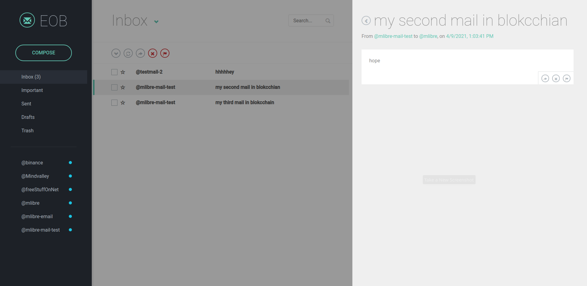
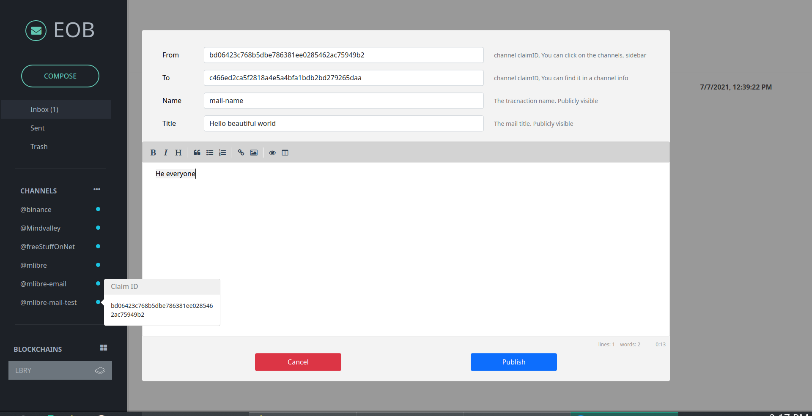

# Email Over Blockchain
Yes! an actual Blockchain Mail app :green_heart:  
Yeees! Send and receive emails over blockchain

# Why Blockchain mail ?
1. First of all, YOU are in control. No one can restrict your access nor receiving a mail
2. Finally no spam. Because sending emails over blockchain costs a fee.
3. Secure by default. blockchain is secure by default. cryptography, no single point of failure, ...
4. It is always there. Your email is always there. no one can delete them nor change them
5. YOU can only read them. cryptography technology in blockchain make sure you are the only reader of your mails

# About EOB (Email Over Blockchain)
It is a fun project, to demonstrate the possibility of how blockchain email could look like.  But I improved it over time.  
and now `EOB` actually is a nice cool blockchain mail app.  

I wrote it on top of the `LBRY` protocol.  It is not the best fit for such a service, but it is good enough.  
I may continue this project, and maybe make a whole blockchain for it.  
Feel free to contribute :grinning: 

# How it works
`EOB` works on the `LBRY` blockchain.  
Sending an email is creating a transaction in the blockchain, this transaction contains email metadata.  
So you keep the mail metadata in the blockchain and the mail itself in somewhere like `IPFS`.  
Each `LBRY` channel is an account here. You can send and receive emails to/from channels.  
Just like `LBRY`, pretty much everything works with `claims id` here as well :)  

# Screenshots



# Requirments
* lbrynet. you can run lbrynet by running the `LBRY` desktop application.
> https://lbry.com/get

# Install & Run
```bash
git clone https://github.com/mlibre/email-on-blockchain.git
cd email-on-blockchain
npm i
npm install --dev-only
# lbrynet start
npm start
# npm run make
```

# LICENSE
GPLV3 & LICENSE File

Donate or .... :heartpulse:
=======
ETH:
> 0xc9b64496986E7b6D4A68fDF69eF132A35e91838e

LBC:
> bSbZzpNRSn6cPpc6nua6S9cCSckH4W72PD