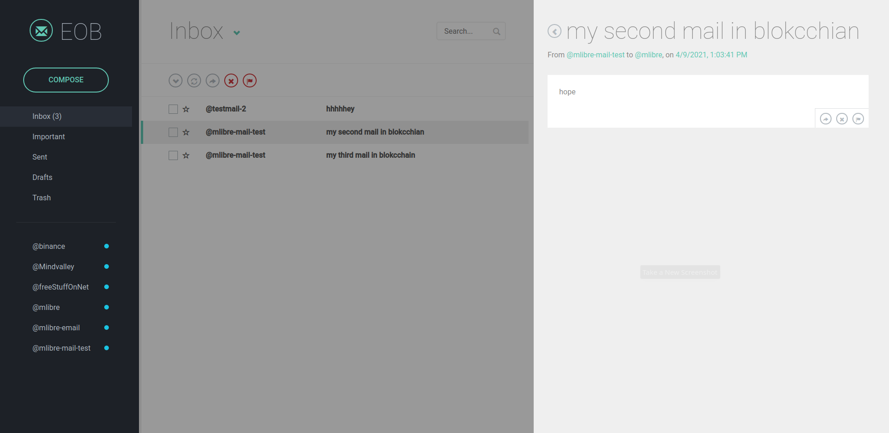
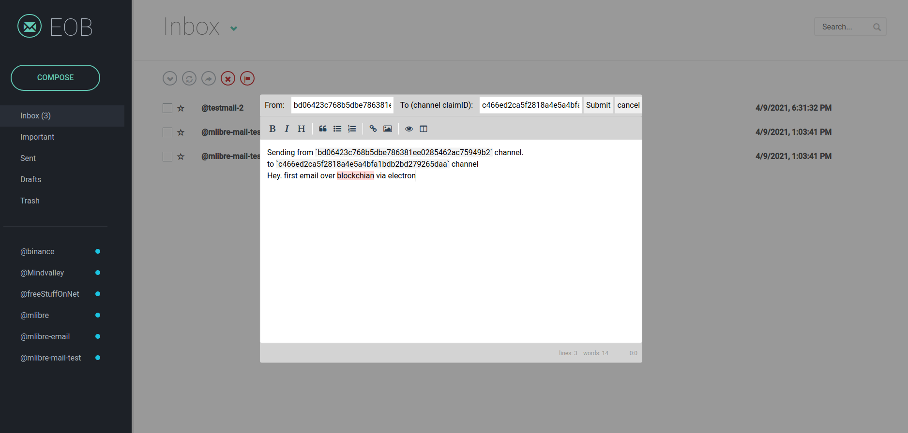

# Email Over Blockchain
Yes! An actual Blockchain mail :green_heart:  
Send and recive emails over blockchain

# Why Blockchain mail anyway?
1. First of all, YOU are in control. No one can restrict your access nor restrict to receive a mail
2. Finally No spam. Sending email over blockchain cost fee.
3. Secure by default. blockchain is secure by default as it does not have a single point of failure
4. It is always there. Your email is always there. no one can delete them nor change them
5. YOU can only read them. cryptography technology in blockchain make sure you are the only reader of your mails

# About EOB (Email Over Blockchain)
This is a fun project, to demonstrate the possibility of how blockchain email could look like.  
BUT don't get me wrong :)  
`EOB` actually works.  
I wrote it top of `LBRY`.  It is not the best fit for such a service, but it is good enough t show the world how they can implement such a thing.  
There are lots of things that can get improved in this electron app.  
Feel free to contribute :grinning: 

# Screenshots



# Requirments
* lbrynet. you can run lbrynet by running the `LBRY` desktop application.
> https://lbry.com/get

# Install & Run
```bash
git clone https://github.com/mlibre/email-on-blockchain.git
cd email-on-blockchain
npm i
npm install --dev-only
npm start
# lbrynet start
# npm run make
```

# LICENSE
GPLV3

Donate or .... :heartpulse:
=======
ETH:
> 0xc9b64496986E7b6D4A68fDF69eF132A35e91838e

LBC:
> bSbZzpNRSn6cPpc6nua6S9cCSckH4W72PD