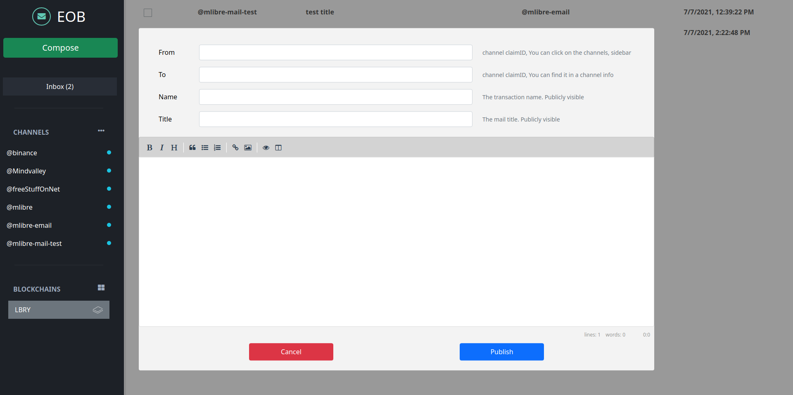

# Email Over Blockchain

Yes! an actual Blockchain Mail App :green_heart:  
Send and receive emails over blockchain

## Why Blockchain Mail?

1. First of all, YOU are in control. No one can restrict your access in any way.
2. Finally no spam. Because sending emails through Blockchain costs a fee.
3. Secure by default. Blockchain is secure by default.
4. It is always there. Your email is always there. no one can delete them nor change them
5. YOU can only read them. cryptography technology in Blockchain make sure you are the only reader of your mails

## About EOB (Email Over Blockchain)

It is a fun project, to demonstrate how blockchain email could look like. It is a simple app that allows you to send and receive emails over Blockchain.

EOB is on top of the `LBRY` protocol. However It is not the best fit for such a service, but it is good enough.  
Feel free to contribute :grinning:

## How it works

`EOB` works with the `LBRY` blockchain.  
Sending an email is creating a transaction in the blockchain, this transaction contains email metadata.  
So you keep the mail metadata in the blockchain and the mail itself in somewhere like `IPFS`.  
Each `LBRY` channel is an account here. You can send and receive emails to/from channels.

## Screenshots




## Requirements

* `lbrynet`: you can run `lbrynet` by running the `LBRY` desktop application.

> <https://lbry.com/get>

## Install & Run

```bash
git clone https://github.com/mlibre/email-on-blockchain.git
cd email-on-blockchain
npm i
npm install --dev-only
```

Make sure `lbrynet` is running.

```bash
lbrynet start
```

Then run the app.

```bash
npm start
```

## Issues with LBRY

* Mails on lbry protocols are not encrypted yet!
* If the sender of the mail abandon the claim, metadata will be lost

## LICENSE

[LICENSE File](./LICENSE)

## Donate :heartpulse

ETH:
> 0xc9b64496986E7b6D4A68fDF69eF132A35e91838e

LBC:
> bSbZzpNRSn6cPpc6nua6S9cCSckH4W72PD
